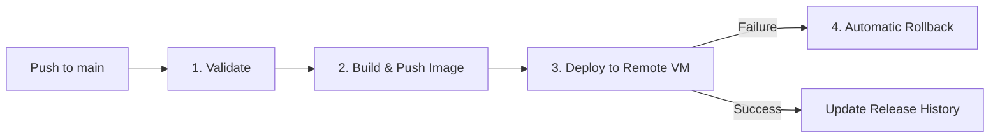

# AIAIC Farmers Platform — Deployment & Service Operations Guide

This handbook provides the complete operational and architectural documentation for deploying and maintaining the **AIAIC Farmers Platform** (Farmer Interface & Decision Dashboard) on the remote production VM using Docker, Docker Compose, and GitHub Actions CI/CD.

---

## 1. System Architecture Overview

The system is built on a **Mobile-First Server Proxy Architecture (Backend-for-Frontend / BFF)** using **React 19**, **TanStack Start (SSR)**, and the **Nitro** server engine.

```
┌─────────────────────────────────────────────────────────────────────────────┐
│                              Farmer Web Client                              │
│         (React 19 + TanStack Router + Tailwind CSS v4 + Web Speech API)     │
└──────────────────────────────────────┬──────────────────────────────────────┘
                                       │ Server Functions (RPC)
                                       ▼
┌─────────────────────────────────────────────────────────────────────────────┐
│                    TanStack Start SSR / Nitro Server                        │
│                   (Running on Node.js 22 / Vite 8 Engine)                   │
│                                                                             │
│  [aiaic.functions.ts]       [catalog.functions.ts]     [plant.functions.ts] │
└───────────┬──────────────────────────┬──────────────────────────┬───────────┘
            │                          │                          │
            ▼                          ▼                          ▼
┌───────────────────────┐  ┌───────────────────────┐  ┌───────────────────────┐
│ AIAIC Decision Engine │  │ Engine Live Catalog   │  │ Plant Intelligence    │
│ (Mandi/Weather/Water) │  │  (Cached 5 minutes)   │  │ (Photo Diagnostic)    │
└───────────────────────┘  └───────────────────────┘  └───────────────────────┘
                                       │
                                       ▼
                          ┌──────────────────────────┐
                          │   Supabase Cloud DB      │
                          │ (PostgreSQL Feedback RLS)│
                          └──────────────────────────┘
```

### Key Subsystems:
* **Frontend Web Application**: Mobile-first, tri-lingual (EN, HI, MR) farmer dashboard with high accessibility (56px+ tap targets, high contrast, Web Speech audio readout).
* **SSR Server & BFF Proxy**: Nitro Node.js standalone server routing upstream queries to the AIAIC Decision Engine (`https://disarm-scrubbed-pushiness.ngrok-free.dev`) and Plant Intelligence services securely without exposing headers or tokens to the browser.
* **Database Layer**: Remote Supabase PostgreSQL storing anonymous farmer ratings and feedback (`public.advice_feedback`).

---

## 2. Port Allocation & Matrix

To prevent port collisions with other BHIV services sharing the production VM, the platform is mapped to **host port `3008`**.

| Service Name | Container Name | Container Port | Host Port | Protocol | Purpose |
| :--- | :--- | :--- | :--- | :--- | :--- |
| **AIAIC Farmers Platform** | `aiaic_farmers_platform` | `3000` | `3008` (or `${AIAIC_PORT}`) | HTTP | SSR Web Application & BFF Endpoints |
| *Shakti Dashboard* | `shakti-dashboard` | `5173` | `5176` | HTTP | Shakti Command Center |
| *Gurukul Backend* | `gurukul_backend` | `3000` | `3002` | HTTP | Gurukul Core API |
| *EMS Backend* | `ems_backend` | `8000` | `8001` | HTTP | EMS Service |
| *EMS Frontend* | `ems_frontend` | `3001` | `3001` | HTTP | EMS Dashboard |
| *Samruddhi Backend* | `samruddhi_backend` | `8000` | `8000` | HTTP | Samruddhi Trading API |
| *Parikshak Backend* | `parikshak_backend` | `8000` | `8002` | HTTP | Governance Engine |
| *Prana Backend* | `prana_backend` | `8103` | `8103` | HTTP | Ingestion Pipeline |

---

## 3. Docker Containerization

The production build uses a hardened multi-stage Dockerfile ([Dockerfile](file:///c:/Users/ASUS/OneDrive/Desktop/BHIV-Tasks/AIAIC-Farmers-Platform/AIAIC-Farmers-Platform/Dockerfile)):

- **Stage 1 (Builder)**: `node:22-alpine` performs dependency caching, argument injection, and executes `NITRO_PRESET=node-server npm run build` to generate standalone server `.output/`.
- **Stage 2 (Runner)**: `node:22-alpine` with non-root security (`appuser:appgroup`), native healthcheck probing `http://localhost:3000/`, and minimal footprint.

```bash
# Build image locally
docker build -t bhiv/aiaic-farmers-platform:latest -f Dockerfile .

# Run container locally
docker run -d --name aiaic_farmers_platform -p 3008:3000 --env-file .env bhiv/aiaic-farmers-platform:latest
```

---

## 4. GitHub Actions CI/CD Pipeline

The automated CI/CD pipeline ([`.github/workflows/cicd.yml`](file:///c:/Users/ASUS/OneDrive/Desktop/BHIV-Tasks/AIAIC-Farmers-Platform/AIAIC-Farmers-Platform/.github/workflows/cicd.yml)) triggers on every push to the `main` branch.

### Pipeline Stages:



1. **`validate`**:
   - Validates compose YAML syntax via `docker compose config`.
   - Runs TypeScript typecheck (`tsc --noEmit`) and ESLint (`npm run lint`).
   - Packages and uploads deployment template artifacts.
2. **`build`**:
   - Builds production Docker image with Git short SHA tag.
   - Pushes `bhiv/aiaic-farmers-platform:<sha>` and `bhiv/aiaic-farmers-platform:latest` to Docker Hub.
3. **`deploy`**:
   - Securely connects to target VM via SSH / `sshpass`.
   - Copies deployment bundle to `~/AIAIC_FARMERS`.
   - Restores release history from `/var/tmp/AIAIC_FARMERS/RELEASE_HISTORY.md`.
   - Pulls fresh image and restarts container stack (`docker compose up -d --remove-orphans`).
   - Runs 12-step (120s max) healthcheck verifying HTTP 200 on port 3008.
   - Updates release registry `docs/RELEASE_HISTORY.md` and backs up to `/var/tmp/AIAIC_FARMERS/`.
   - Automatically prunes stale images older than 7 days (`168h`).
4. **`rollback`**:
   - Executes automatically if deployment or healthchecks fail.
   - Safely parses `docs/RELEASE_HISTORY.md` for the last known stable Git commit SHA.
   - Deploys the previous healthy version, confirms port responsiveness, and logs `ROLLBACK_SUCCESS`.

---

## 5. Required GitHub Secrets Checklist

Configure these secrets in GitHub Repository Settings (`Settings` $\rightarrow$ `Secrets and variables` $\rightarrow$ `Actions`):

| Secret Name | Description | Example / Default |
| :--- | :--- | :--- |
| `DOCKER_USERNAME` | Docker Hub username / organization | `bhiv` |
| `DOCKER_PASSWORD` | Docker Hub access token or password | `dckr_pat_...` |
| `VM_IP` | Remote Production VM IP address | `163.128.xxx.xxx` |
| `VM_PORT` | SSH Port on Production VM | `22` |
| `VM_USERNAME` | SSH username | `ubuntu` / `azureuser` |
| `VM_PASSWORD` | SSH password (or secret authentication string) | `********` |
| `AIAIC_ENV_FILE` *(Recommended)* | Complete production `.env` payload (from `.env.production.template`) | *See template below* |
| `AIAIC_BASE_URL` *(Optional)* | Upstream decision engine backend URL | `https://disarm-scrubbed-pushiness.ngrok-free.dev` |
| `SUPABASE_URL` *(Optional)* | Supabase project URL | `https://fhwwpasgebufuznthynv.supabase.co` |
| `SUPABASE_PUBLISHABLE_KEY` *(Optional)* | Supabase public API key | `sb_publishable_xTto...` |

---

## 6. VM Manual Operations & Runbook

### Directory Location on VM:
```bash
cd ~/AIAIC_FARMERS
```

### Viewing Container Status:
```bash
docker compose -f docker-compose.production.yml ps
```

### Checking Live Application Logs:
```bash
# Follow logs in real-time
docker compose -f docker-compose.production.yml logs -f --tail=100
```

### Restarting the Platform:
```bash
docker compose -f docker-compose.production.yml restart
```

### Stopping and Starting the Stack:
```bash
# Stop stack
docker compose -f docker-compose.production.yml down

# Start stack in background
docker compose -f docker-compose.production.yml up -d
```

### Performing a Health Check:
```bash
# Test local HTTP response on VM
curl -i http://localhost:3008/
```

### Inspecting Release History:
```bash
cat docs/RELEASE_HISTORY.md
```

### Manual Rollback to Specific SHA:
```bash
# Example: Rollback to commit abc1234
sed -i 's|image: bhiv/aiaic-farmers-platform:.*|image: bhiv/aiaic-farmers-platform:abc1234|' docker-compose.production.yml
docker compose -f docker-compose.production.yml pull
docker compose -f docker-compose.production.yml up -d --remove-orphans
curl -f http://localhost:3008/
```

---

## 7. Troubleshooting Matrix

| Symptom | Probable Cause | Action |
| :--- | :--- | :--- |
| **Port 3008 Connection Refused** | Container not running or port binding mismatch | Run `docker compose -f docker-compose.production.yml ps` and inspect `docker compose logs`. Check `.env` for `AIAIC_PORT`. |
| **500 Internal Server Error on Advice Screen** | AIAIC engine ngrok tunnel is down or rotated | Check `AIAIC_BASE_URL` in `.env` and verify upstream endpoint connectivity via `curl -i "$AIAIC_BASE_URL/catalog"`. |
| **Feedback Submission Fails** | Supabase publishable key / URL invalid | Verify `SUPABASE_URL` and `SUPABASE_PUBLISHABLE_KEY` in `.env`. Ensure Supabase project is active. |
| **CI/CD Fails at Deploy Step** | SSH connection failure or invalid VM credentials | Verify `VM_IP`, `VM_PORT`, `VM_USERNAME`, and `VM_PASSWORD` in GitHub Secrets. |
| **Container Unhealthy Status** | Node SSR process failed during startup | Run `docker logs aiaic_farmers_platform` to inspect Node.js error trace and verify `NODE_ENV=production`. |
